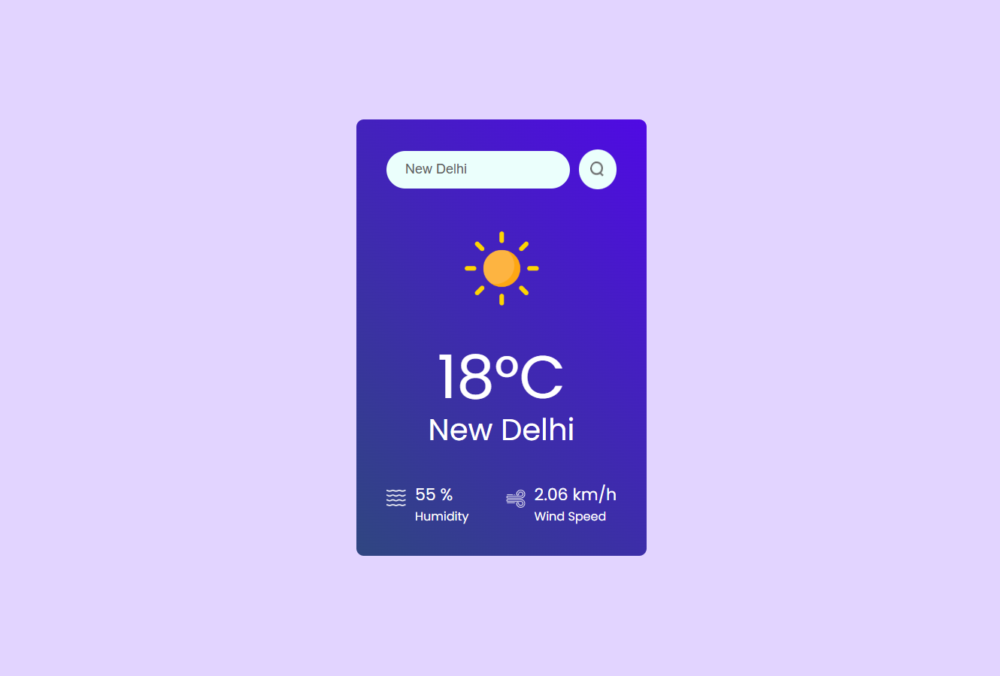

# 🌤️ React Weather App

A **modern, clean & functional weather app** built with React.js that allows you to search for any city and view the current weather — including temperature, humidity, wind speed, and an icon representing the weather condition. This project uses the **OpenWeatherMap API** to fetch real-time data. ([YouTube][1])

---

## 📌 Features

✔️ Search weather by city name
✔️ Displays current temperature in **°C**
✔️ Shows **humidity** and **wind speed**
✔️ Dynamic weather icon based on conditions
✔️ Clean responsive UI
✔️ Built with React and modern JavaScript

---
## 🖼️ Screenshots

### 🌤️ Home Screen


---

## 🛠️ Built With

* **React** – UI library
* **OpenWeatherMap API** – Weather data
* **Vite (optional)** – Fast dev environment
* **CSS** – Styling
* Icons & Assets – Local image assets

---

## 📦 Installation

1. **Clone the repository**

   ```bash
   git clone https://github.com/your-username/weather-app-react.git
   ```

2. **Install dependencies**

   ```bash
   npm install
   ```

   or

   ```bash
   yarn
   ```

3. **Create a `.env` file**
   At the project root, add your OpenWeatherMap API key:

   ```env
   VITE_APP_ID=YOUR_OPENWEATHER_API_KEY
   ```

4. **Start the development server**

   ```bash
   npm run dev
   ```

   or

   ```bash
   yarn dev
   ```

---

## 📁 Project Structure

```
weather-app-react/
├── public/
├── src/
│   ├── assets/
│   │   └── icons (weather icons)
│   ├── components/
│   │   └── Weather.jsx
│   ├── App.jsx
│   ├── index.css
│   └── main.jsx
├── .env
├── package.json
└── README.md
```

---

## 📌 How It Works

1. **User enters a city name**
2. App calls the OpenWeatherMap API:

   ```js
   fetch(`https://api.openweathermap.org/data/2.5/weather?q=${city}&units=metric&appid=${import.meta.env.VITE_APP_ID}`)
   ```
3. API returns weather details
4. Weather data is stored in state and displayed on screen

---

## 🎯 API Details

* This app uses the **Current Weather Data** endpoint from OpenWeatherMap.
* Temperature is shown in **Celsius** using `units=metric`.
* Weather condition icons are mapped to local image files based on the API’s `icon` code. ([YouTube][1])

---

## 📦 Environment Variables

📌 The OpenWeatherMap API key must be stored in an **environment variable** for security.

In `.env`:

```env
VITE_APP_ID=your_openweather_api_key
```

> ⚠️ Do not commit your API key to version control!

---


